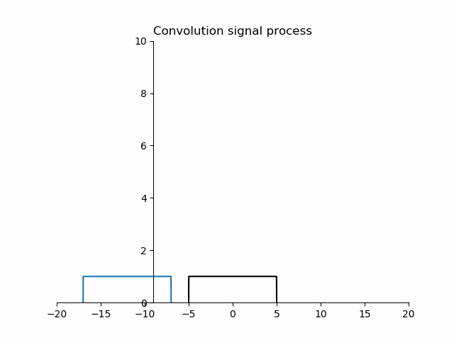

## 卷积信号过程

import numpy as np
import matplotlib.pyplot as plt
from matplotlib import animation
x = np.linspace(-5, 5, 1000)
x1 = np.linspace(-17, -7, 1000)
x_data, y_data = [], []

def init():
    y3 = x1/x1
    y3[0] = 0
    y3[-1] = 0
    line.set_ydata(y3)
    line.set_xdata(x1)
    return line,

def animate(i):
    n = 0
    x3 = np.linspace(-17 + i, -7 + i, 1000)
    y2 = x1 / x1
    y2[0] = 0
    y2[-1] = 0
    line.set_ydata(y2)
    line.set_xdata(x3)
    if i == 0:
        global x_data, y_data
        x_data, y_data = [], []
        line1, = ax1.plot(x_data, y_data)

    if -12 + i >= -10 and i < 12:
        x_data.append(-12 + i)
        y_data.append((-12 + i)+10)
        line1, = ax1.plot(x_data, y_data)
        n += 1
        return line, line1,
    elif i >= 12:
        x_data.append(-12 + i)
        y_data.append(-(-12 + i)+10)
        line1, = ax1.plot(x_data, y_data)

        return line, line1,

    return line,

fig, ax1 = plt.subplots()
ax = plt.gca()
ax.spines['right'].set_color('none')
ax.spines['top'].set_color('none')
ax.xaxis.set_ticks_position('bottom')
ax.yaxis.set_ticks_position('left')
ax.spines['bottom'].set_position(('data', 0))
ax.spines['left'].set_position(('data', -9))
y = x/x
y[0] = 0
y[-1] = 0
ax1.plot(x, y, "black")
ax1.set_xlim((-20, 20))
ax1.set_ylim((0, 10))
ax1.set_title("Convolution signal process")
y1 = x1 / x1
y1[0] = 0
y1[-1] = 0
line, = ax1.plot(x1, y1)
ani = animation.FuncAnimation(init_func=init, frames=30, interval=100, blit=True, func=animate, fig=fig)
ani.save('sin_dot.gif', writer='imagemagick', fps=5)
plt.show()

