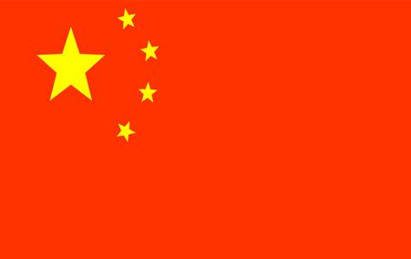

##图形叠加
```
import cv2
img = cv2.imread(r'F:\timg.bmp')
img2 = cv2.imread(r'F:\2.bmp')

img2 = cv2.resize(img2, (250, 200))
img = cv2.resize(img, (800, 500))
for i in range(200):
    for j in range(250):
        img[i, j] = [0, 0, 0]
        img[i, j] = img2[i, j]
        print(i)
cv2.imshow('s', img)
print(img.shape)
print(img.size)
print(img2.shape)
print(img2.size)
cv2.imwrite(r'F:/addimage.bmp', img)
cv2.waitKey(0)
```


