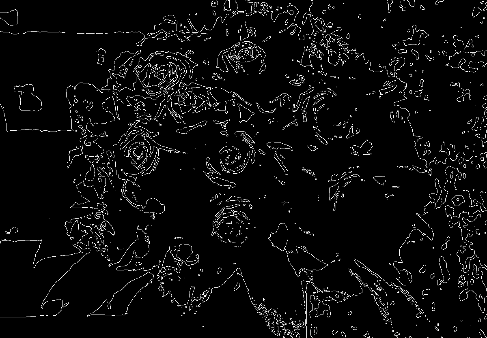

## 二极化和边缘检测
```
import cv2 as cv
import matplotlib.pyplot as plt
import  numpy as np


def average(img):
    sum_ = 0
    for i in img:
        sum_ += sum(i)
    return sum_//img.size


img_gray_ = cv.imread(r'F:\flower.bmp', 0)
img_gray = cv.imread(r'F:\flower.bmp', 0)
cv.imshow('flwoer1', img_gray)
print(img_gray)
print(img_gray.size)
print(img_gray.shape)
print(len(img_gray))
ave = average(img_gray)

for i in range(835):
    for j in range(1200):
        if img_gray[i, j] <= ave:
            img_gray[i, j] = 0
        else:
            img_gray[i, j] = 2550
cv.imshow('flower2', img_gray)
img = cv.Canny(img_gray, 100, 200)

cv.imshow('flower3', img)
plt.show()
cv.imwrite(r'C:\Users\Monster\Desktop\flower_gray.bmp', img_gray_)
cv.imwrite(r'C:\Users\Monster\Desktop\flower_two value.bmp', img_gray)
cv.imwrite(r'C:\Users\Monster\Desktop\flower_b.bmp', img)
cv.waitKey(0)
cv.destroyAllWindows()


```
* 灰图

* 二极化

* 边缘检测 canny
